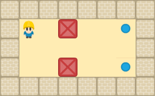

# 📦 Sokoban

> Le grand classique du puzzle, en JavaScript pur — avec déplacement automatique du
> personnage au clic, propulsé par un **algorithme A\***.


**🎮 [Jouer en ligne](https://clebail.github.io/sokojs/)**

<p align="center">
  
</p>

Poussez toutes les caisses (📦) sur leurs emplacements cibles (🎯) pour résoudre
chaque niveau. Vous pouvez vous déplacer case par case au clavier, ou **cliquer
sur une case accessible** : le personnage s'y rend tout seul par le plus court
chemin.

---

## ✨ Fonctionnalités

- **32 niveaux** au format standard `.xsb` (notation Sokoban universelle).
- **Déplacement automatique au clic** : un clic sur une case libre déclenche un
  calcul de plus court chemin (A\*) et le personnage s'y déplace en animation.
- **Contrôle clavier** classique aux flèches directionnelles.
- **Annulation** (undo) illimitée et **rechargement** du niveau en cours.
- **Compteurs** de mouvements et de poussées + **meilleur score** par niveau,
  conservé dans le navigateur (`localStorage`).
- **Détection automatique de victoire**.
- **100 % statique** : aucun back-end, déployable tel quel sur GitHub Pages.
- **Code testé** (suite `node:test`) et architecture découplée.

## 🎮 Comment jouer

| Action | Commande |
|--------|----------|
| Se déplacer | Flèches ⬆️ ⬇️ ⬅️ ➡️ |
| Aller à une case (auto) | Clic gauche sur une case libre |
| Annuler le dernier coup | Bouton ↩️ *Annuler* |
| Recharger le niveau | Bouton 🔄 *Recharger* |
| Changer de niveau | Liste déroulante *Sélection du niveau* |

**But du jeu** : poussez chaque caisse sur une cible. On ne peut pousser qu'une
seule caisse à la fois, et jamais contre un mur ou une autre caisse.

## 🧭 Le déplacement automatique (A\*)

Le cœur « algorithmique » du projet est le pathfinding au clic. Quand vous cliquez
sur une case, [`astar.js`](astar.js) calcule le plus court chemin entre le joueur et
la case visée, puis le personnage le rejoue pas à pas.

L'implémentation est volontairement **découplée de tout rendu** :

```js
astar(start, goal, isWalkable) -> ["haut" | "bas" | "gauche" | "droite", ...]
```

`isWalkable(x, y)` est le **seul pont** avec le modèle de jeu : il renvoie `false`
pour un mur, une caisse ou une case hors grille. L'A\* ne touche jamais au DOM.

Choix techniques notables :

- **Heuristique de Manhattan** (`|dx| + |dy|`) — exacte sur une grille à
  4 directions, donc bien plus efficace qu'une heuristique euclidienne.
- **Open list = min-heap binaire** — `push`/`pop` en `O(log n)`.
- **Coûts connus dans une `Map` `"x,y" → g`** — accès en `O(1)`.
- Un voisin n'est rouvert que si le nouveau coût `g + 1` est **strictement
  meilleur** que celui déjà connu, ce qui garantit un chemin optimal sans doublons.

## 🏗️ Architecture

Le code sépare strictement **modèle**, **rendu**, **pathfinding** et **contrôle** :

| Fichier | Rôle | Dépend du DOM ? |
|---------|------|:---------------:|
| [`game.js`](game.js) | Modèle de jeu pur : état (grille en mémoire), règles, `tryMove` / `undo`, victoire | ❌ |
| [`astar.js`](astar.js) | Pathfinding A\* autonome (min-heap, Manhattan) | ❌ |
| [`level.js`](level.js) | Parsing d'un niveau `.xsb` (texte) vers l'objet du modèle | ❌ |
| [`render.js`](render.js) | Rendu DOM (jQuery), applique des *diffs* sans connaître les règles | ✅ |
| [`main.js`](main.js) | Contrôleur : entrées utilisateur, chargement `fetch`, scores, orchestration | ✅ |

Les opérations du modèle renvoient un **diff** décrivant ce qui a bougé
(`{ joueur, caisse?, won }`), que le rendu applique sans rejouer la moindre règle
de jeu. Cette frontière nette est aussi ce qui rend le modèle et l'A\* testables
hors navigateur.

## 🚀 Lancer le projet

Le jeu est **entièrement statique** : pas de build, pas de dépendance à installer
(jQuery est fourni dans le dépôt). Les niveaux sont chargés via `fetch`, qui exige
un contexte HTTP — il suffit de servir le dossier par n'importe quel serveur web :

```bash
# Au choix, depuis la racine du projet :
python3 -m http.server 8000
# ou
npx serve
# ou
php -S localhost:8000
```

Puis ouvrez <http://localhost:8000/> dans votre navigateur.

> ⚠️ Ouvrir `index.html` directement en `file://` ne fonctionne pas : la plupart
> des navigateurs bloquent `fetch` sur ce protocole. Passez par un serveur (local
> ou GitHub Pages).

## ✅ Tests

Le modèle de jeu et l'A\* sont couverts par des tests unitaires exécutés avec le
*test runner* natif de Node (aucune dépendance) :

```bash
npm test        # ou : node --test
```

Sont notamment vérifiés : chemin trouvé, **optimalité** du chemin, cas sans
solution, les règles de déplacement / poussée / annulation, et le parsing des
niveaux `.xsb`.

## 🗺️ Format des niveaux (`.xsb`)

Les niveaux utilisent la notation Sokoban standard, un caractère par case :

| Caractère | Signification |
|:---------:|---------------|
| `#` | Mur |
| `@` | Joueur |
| `+` | Joueur sur une cible |
| `$` | Caisse |
| `*` | Caisse sur une cible |
| `.` | Cible (emplacement) |
| (espace) | Sol libre |

Pour **ajouter un niveau**, déposez un fichier `levelXXXX.xsb` (numérotation sur
4 chiffres) à la racine et ajoutez l'entrée correspondante dans la liste
déroulante de [`index.html`](index.html).

## 📄 Licence

Projet personnel — voir le dépôt pour les conditions de réutilisation.
